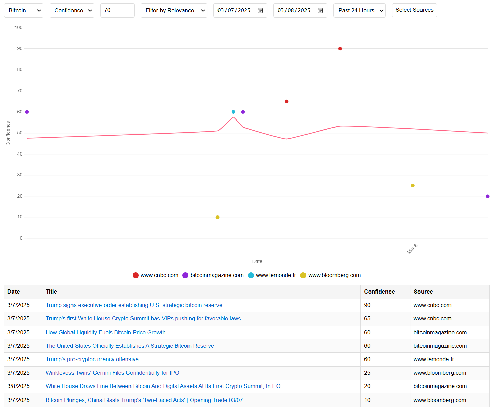

# TrendView

TrendView is a tool that leverages AI to analyze and visualize trends.

## Project Status

This project is currently in the prototype stage. It was built rapidly over a few days but is designed to be modular and extendable, allowing for future enhancements and integrations.

You can easily set up and run this project entirely locally.

## Prerequisites

Before using TrendView, ensure you have the following installed:

- **Golang**: Download and install Golang from [the official website](https://golang.org/dl/).
- **Ollama**: Download and install Ollama from [Ollama's website](https://ollama.com/).

To run Ollama in server mode, use the following command:

```sh
ollama serve
```

## Example Results

Below is an example of the calculated confidence in Bitcoin based on recent news. The confidence score ranges from 0 to 100, with higher scores indicating greater confidence.



## Example Commands

### Generate Trends

To generate trends, use the following command:

```sh
go run .\cmd\trendview generate -config .\config\global-rating-configuration.json -datafile .\data\global.db -loop
```

### Run the Web Server Locally

To run the web server, use the following command:

```sh
go run .\cmd\trendview serve -datafile .\data\global.db
```

Once the server is running, you can access the endpoint on your local machine at:

[http://localhost:8081/](http://localhost:8081/)

### Convert to CSV

To convert the data to a CSV file, use the following command:

```sh
go run .\cmd\trendview convert-to-csv -datafile .\data\global.db > .\data\global.csv
```

### Run Unit Tests

To run unit tests, use the following command:

```sh
go clean -testcache; go test ./...
```

## Example configuration
```json
{
    "RssFeedReaders": [
        {
            "Url": "https://www.theguardian.com/uk/technology/rss",
            "ShouldCleanHtml": true
        },
        {
            "Url": "https://feeds.bloomberg.com/markets/news.rss"
        },
        {
            "Url": "https://feeds.bloomberg.com/technology/news.rss"
        },
        {
            "Url": "https://www.lemonde.fr/en/economy/rss_full.xml"
        },
        {
            "Url": "https://www.lemonde.fr/en/money-investments/rss_full.xml"
        }
    ],
    "RatingPrompts": [
      {
        "SubjectName": "Microsoft",
        "InsightName": "Confidence",
        "BasePrompt": "Based solely on the news below, rate your confidence in investing in Microsoft stocks from 0 (no confidence, unwise) to 50 (neutral) to 100 (very confident, good opportunity), considering market trends, regulations, or economic factors. News: "
      },
      {
        "SubjectName": "Microsoft",
        "InsightName": "Relevance",
        "BasePrompt": "Based exclusively on the news provided below, evaluate the potential connection to Microsoft's stock price. Assign a rating on a scale from 0 to 100, where:  - 0 = completely unrelated - 50 = somewhat related - 100 = very much related If there is any uncertainty or insufficient information to determine relevance, default to a rating of 0. News: "
      }
    ]
}
```

